# 💸 Smart Expense Splitting & Budget Management

<p align="center">
  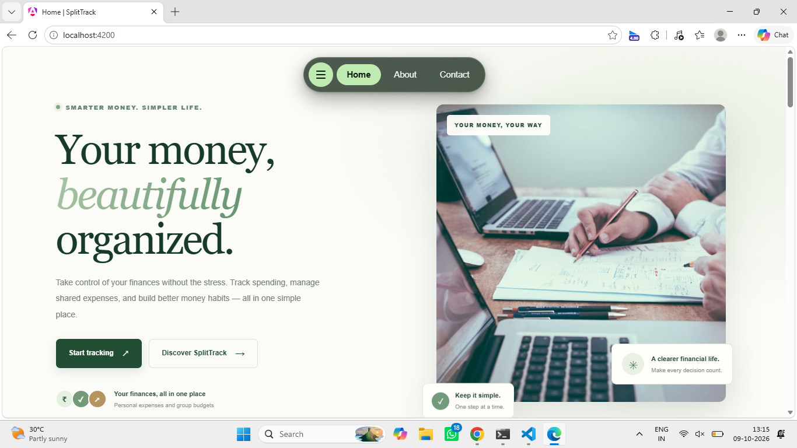
</p>

<h3 align="center">Split expenses. Manage budgets. Stay financially organized.</h3>

<p align="center">
  A modern and responsive expense management application designed to simplify group expenses, shared payments, and personal budgeting.
</p>

<p align="center">
  
  
  
  
  
</p>

<p align="center">
  <a href="#-features">Features</a> •
  <a href="#-screenshots">Screenshots</a> •
  <a href="#-technology-stack">Tech Stack</a> •
  <a href="#-installation-and-setup">Installation</a> •
  <a href="#-project-structure">Project Structure</a>
</p>

---

## 📖 About the Project

**SplitTrack** is a web-based expense splitting and budget management application built to make everyday financial management simpler and more organized.

Managing shared expenses with friends, family, roommates, or travel groups can become complicated. SplitTrack provides a centralized interface for organizing groups, tracking shared expenses, managing budgets, and keeping personal finances organized.

The application features a modern user interface, responsive layouts, and intuitive navigation to provide a smooth experience across supported devices.

🔗 **GitHub Repository:** [Money-Split-Track-Website](https://github.com/rajgorpunam16/Money-Split-Track-Website)

## ✨ Features

### 🏠 Home Page

* Modern landing page with a clean visual design.
* Clear navigation to important application sections.
* Responsive layout for different screen sizes.

### 👥 Group Management

* Organize shared expenses into groups.
* View and manage existing groups.
* Dedicated group creation and editing interface.
* Keep group-related financial information organized.

### 💸 Expense Splitting

* Organize expenses shared between people.
* Make group expense management easier.
* Improve visibility into shared financial responsibilities.

### 📊 Budget Management

* Dedicated budget overview.
* Organize and monitor budget information.
* Keep spending goals and financial planning accessible.

### 👤 Personal Finance

* Dedicated personal finance interface.
* Organize individual expense information.
* Keep personal budgeting separate from shared group expenses.

### 📱 Navigation

* Convenient side navigation menu.
* Easy access to application sections.
* Responsive interface for desktop and mobile layouts.

### ℹ️ About and Contact

* Dedicated About page describing the application.
* Contact page for user inquiries.
* Consistent visual design across application pages.

### 🎨 UI/UX

* Modern application layout.
* Responsive page sections.
* Reusable interface components.
* Styled navigation, forms, and content areas.
* Focus on readability and ease of use.

## 📸 Screenshots

The following screenshots showcase the SplitTrack user interface.

### 🏠 Home Page

<p align="center">
  
</p>

<p align="center"><em>Main landing page of the SplitTrack application.</em></p>

<p align="center">
  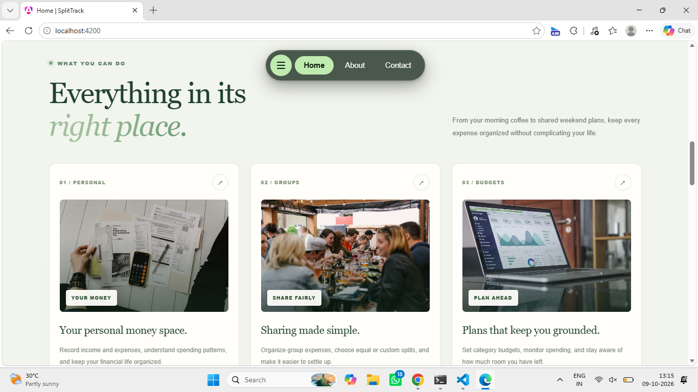
</p>

<p align="center">
  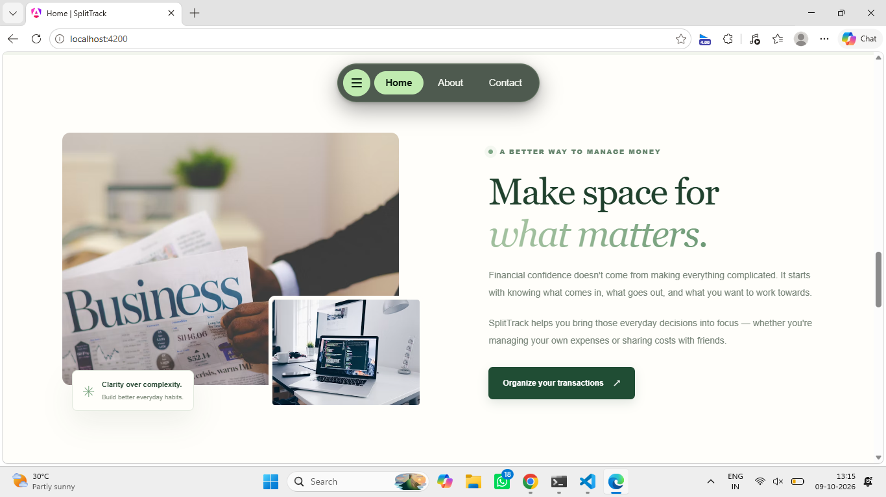
</p>

### 👥 Group Management

<p align="center">
  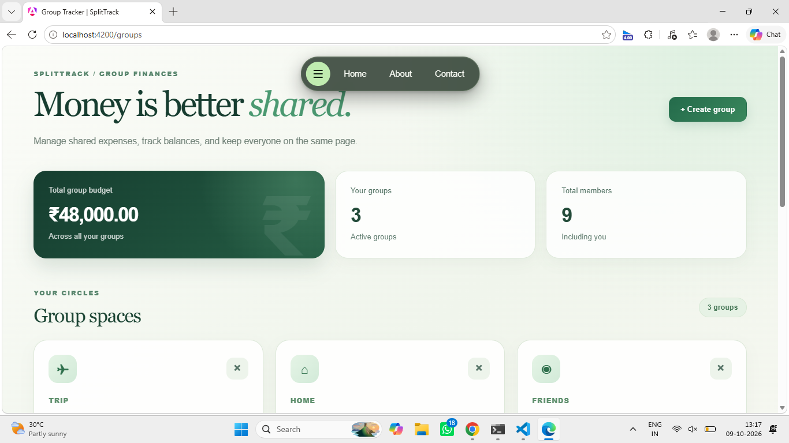
</p>

<p align="center"><em>Group dashboard for organizing shared expenses.</em></p>

<p align="center">
  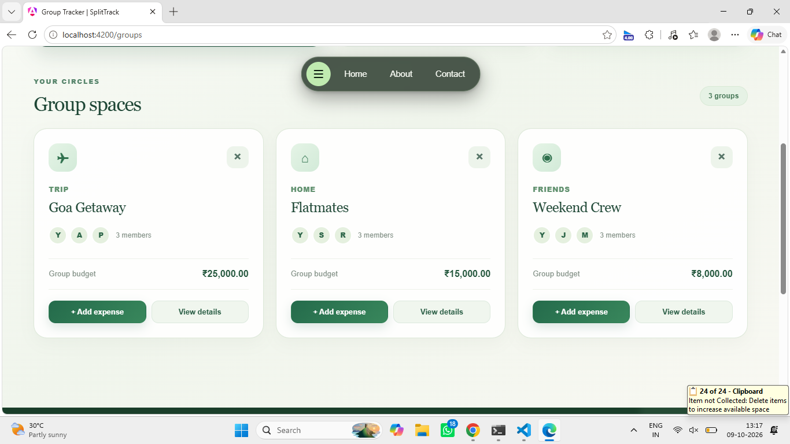
</p>

### ➕ Group Creation Form

<p align="center">
  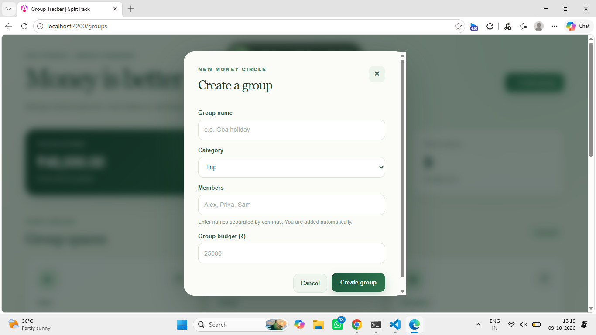
</p>

<p align="center"><em>Interface for creating or editing a group.</em></p>

### 💸 Expense Splitting

<p align="center">
  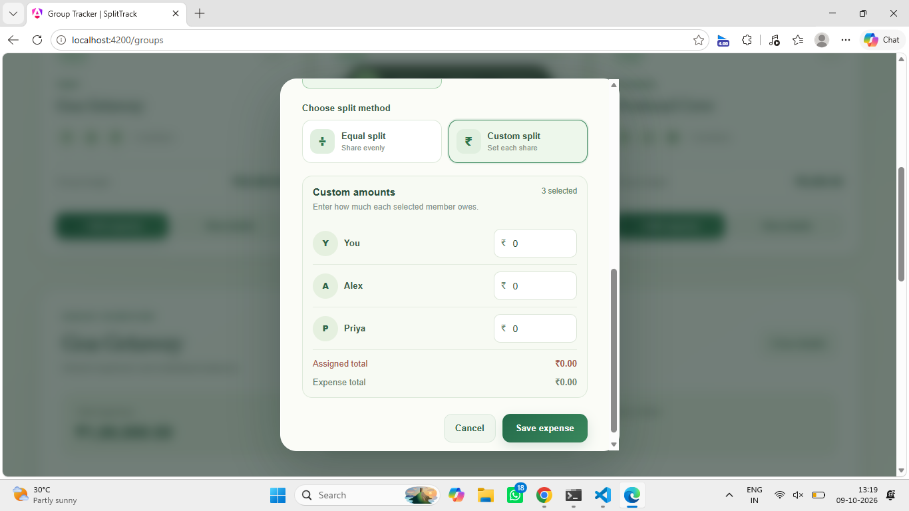
</p>

<p align="center"><em>Expense splitting interface for shared financial management.</em></p>

### 📊 Budget Management

<p align="center">
  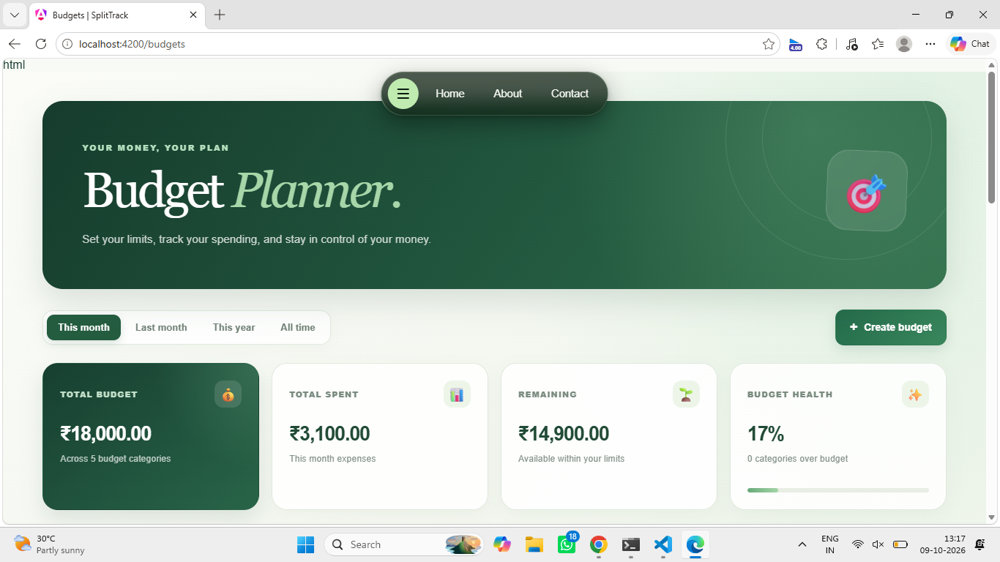
</p>

<p align="center"><em>Budget overview and financial planning interface.</em></p>

<p align="center">
  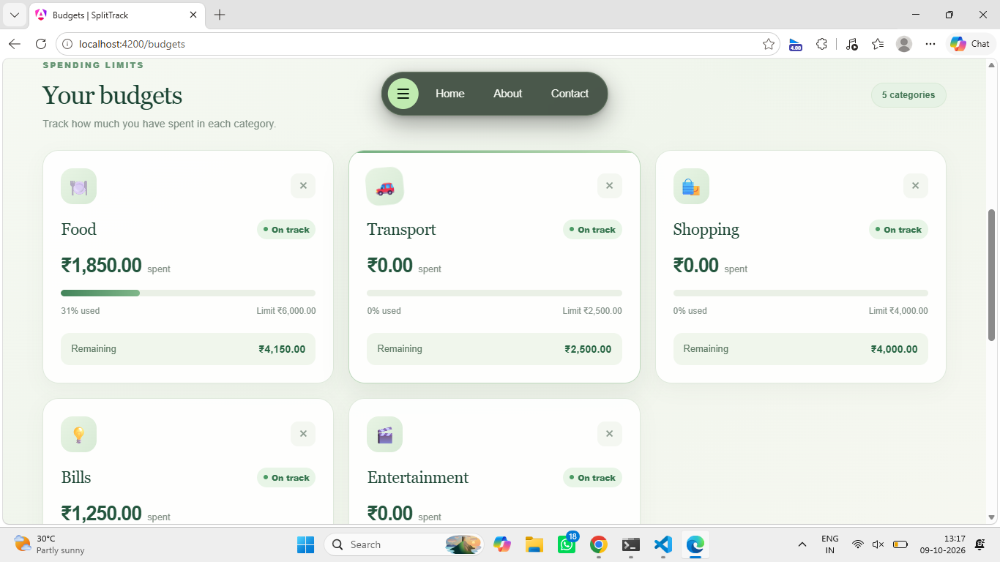
</p>

### 👤 Personal Finance

<p align="center">
  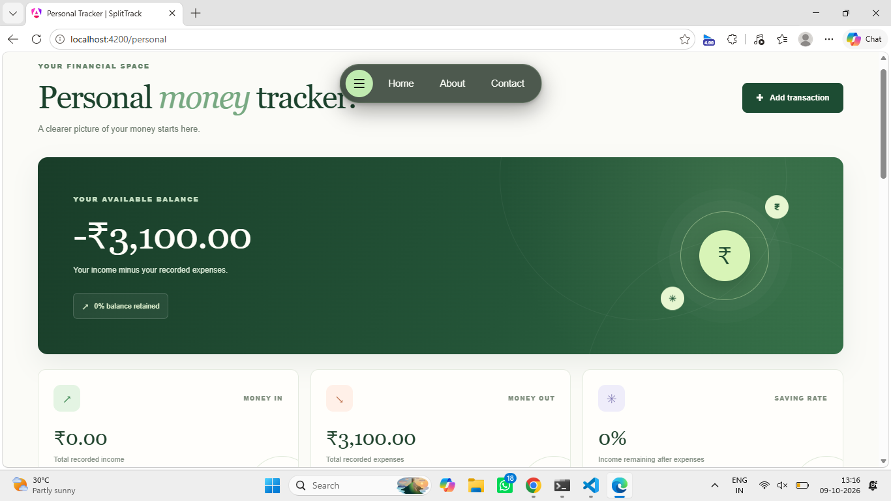
</p>

<p align="center"><em>Personal finance and expense management interface.</em></p>

### 📱 Side Navigation Menu

<p align="center">
  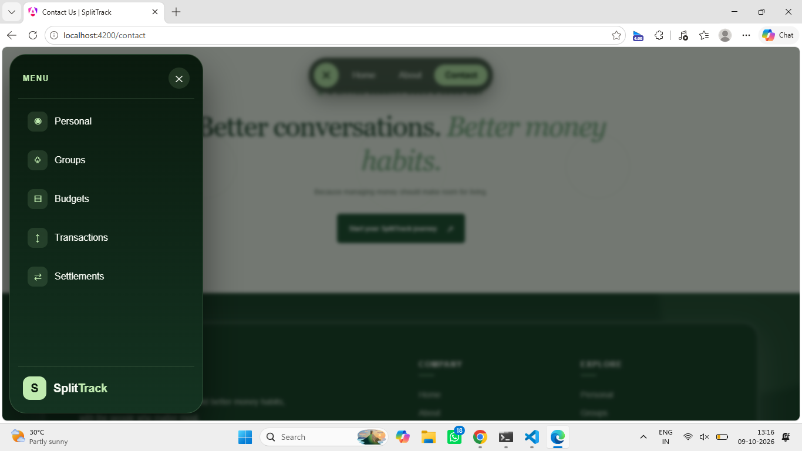
  &nbsp;&nbsp;&nbsp;
  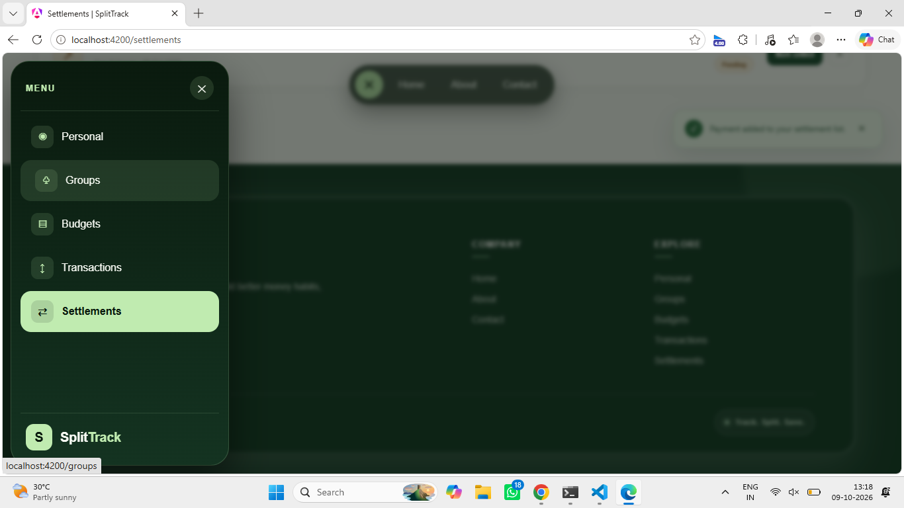
</p>

<p align="center"><em>Navigation options for accessing application sections.</em></p>

### ℹ️ About Page

<p align="center">
  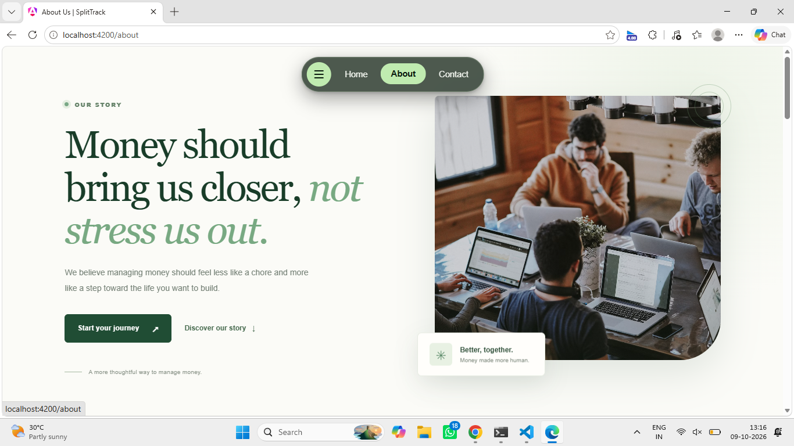
</p>

### 📩 Contact Page

<p align="center">
  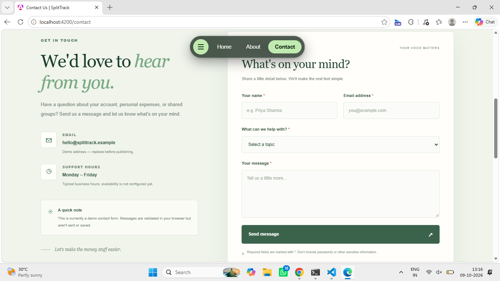
</p>

### 🔻 Footer Design

<p align="center">
  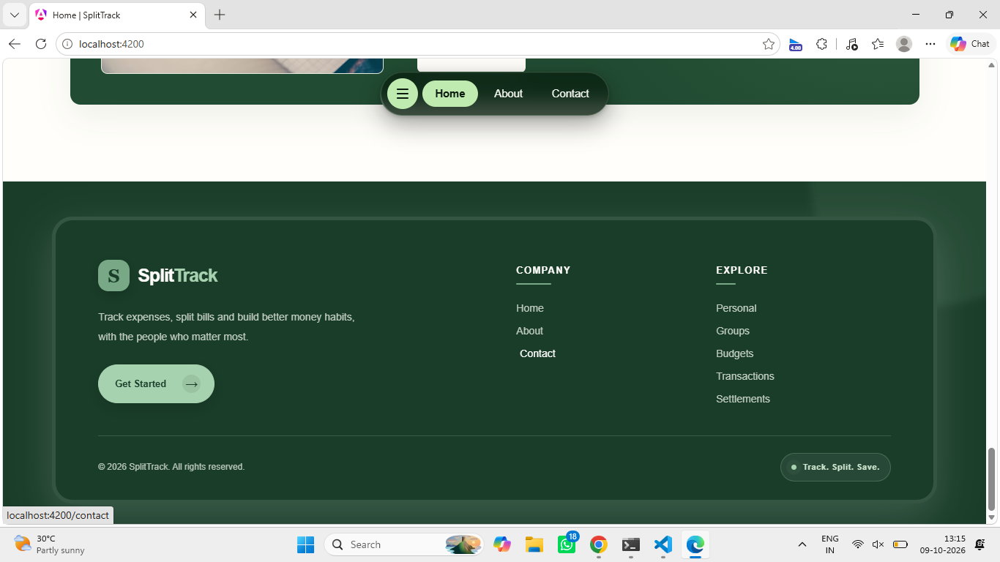
</p>

## 🛠️ Technology Stack

| Technology     | Purpose                                 |
| -------------- | --------------------------------------- |
| Angular 21     | Frontend application framework          |
| Ionic 8        | UI components and application interface |
| TypeScript     | Application programming language        |
| HTML5          | Page structure                          |
| SCSS / CSS     | Styling and responsive layouts          |
| Capacitor 8    | Native mobile application integration   |
| npm            | Dependency and package management       |
| Git and GitHub | Version control and source code hosting |

*Version numbers reflect the project's intended technology stack. Check `package.json` for the exact versions installed in your repository.*

## ⚙️ Installation and Setup

Follow these steps to run SplitTrack locally.

### Prerequisites

Install the following tools:

* [Node.js](https://nodejs.org/)
* npm, included with Node.js
* [Git](https://git-scm.com/)
* Angular CLI compatible with the project

### 1. Clone the Repository

```bash
git clone https://github.com/rajgorpunam16/Money-Split-Track-Website.git
```

### 2. Navigate to the Project Directory

```bash
cd Money-Split-Track-Website
```

### 3. Install Dependencies

```bash
npm install
```

### 4. Start the Development Server

```bash
npx ng serve
```

Alternatively, if the project defines a start script in `package.json`, use:

```bash
npm start
```

### 5. Open the Application

Open your browser and visit:

```text
http://localhost:4200/
```

The development server watches for code changes and reloads the application automatically.

## 🏗️ Build for Production

Generate an optimized production build:

```bash
npx ng build
```

The build output is generated in the `dist/` directory, according to the configuration in `angular.json`.

## 📱 Mobile Application

SplitTrack uses Ionic and Capacitor, which support building web applications for native mobile platforms when the required platform configuration is added.

Typical Capacitor commands include:

```bash
npx cap add android
npx cap sync
npx cap open android
```

Run `npx cap add android` only when the Android platform has not already been added. Android development also requires the appropriate Android Studio setup.

## 🔒 Data Storage

SplitTrack is designed to support expense tracking and budgeting without requiring a traditional backend server for its local-first architecture.

The actual persistence mechanism depends on the application configuration. Review the source code to determine how expenses, groups, budgets, and other user data are stored.

## 🚀 Future Enhancements

Potential improvements for future versions include:

* Secure user authentication and profile management.
* Detailed financial analytics and spending charts.
* Automated settlement recommendations.
* Expense history and downloadable reports.
* Recurring expense management.
* Budget alerts and notifications.
* Enhanced offline support and mobile usability.
* Data export and backup functionality.

## 🎯 Project Objective

The primary objective of SplitTrack is to simplify personal and shared financial management through an accessible application that combines expense splitting, group organization, and budgeting in one place.

The project also demonstrates frontend application development using Angular, Ionic, TypeScript, and modern web technologies.

## 👩‍💻 Author

**Punam Rajgor**

* GitHub: [@rajgorpunam16](https://github.com/rajgorpunam16)
* Project: [Money-Split-Track-Website](https://github.com/rajgorpunam16/Money-Split-Track-Website)

## 📄 License

This project is developed for educational and personal development purposes. Unless a license file is included in the repository, all rights remain with the copyright holder. Add an open-source license if you intend to permit reuse and redistribution under specific terms.

---

<p align="center">
  Made with ❤️ using Angular and Ionic
</p>

<p align="center">
  ⭐ If you find SplitTrack interesting, consider starring the repository!
</p>
